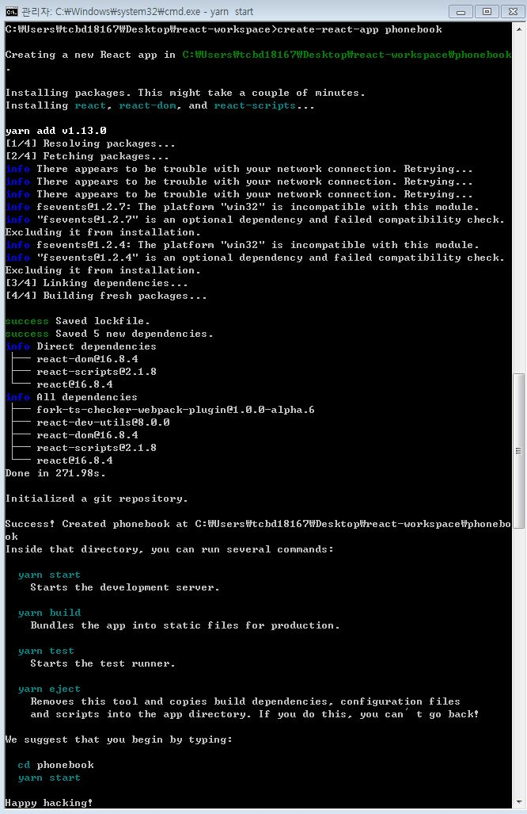

This project was bootstrapped with [Create React App](https://github.com/facebook/create-react-app).

## Create a simple phonebook in React

 

> React 공부 목적으로 만든 본 프로젝트는 velopert blog를 참고하여 만들었습니다.  
> https://velopert.com/

 

#### `개발,기술 환경`  

- Windows  
- React (create-react-app)  
- Node.js (v11.11.0)  
- yarn (1.13.0)  
- Atom  

 

#### `설치 및 환경 구성 순서`  

1. nvm을 설치(brew 같은거임)
2. nvm을 통하여 node 설치(npm자동 설치 됨)
3. yarn 설치(npm 보다 낫다고 함)
4. react를 별도의 config 없이 시작할 수 있게 제공한 create-react-app 시작

 

 
  
5. 통합개발툴은 atom 으로
7. 코딩

 

- webpack이란?
- babel이란?
- jsx란?
- npm과 yarn의 차이

 

## 주요기능
